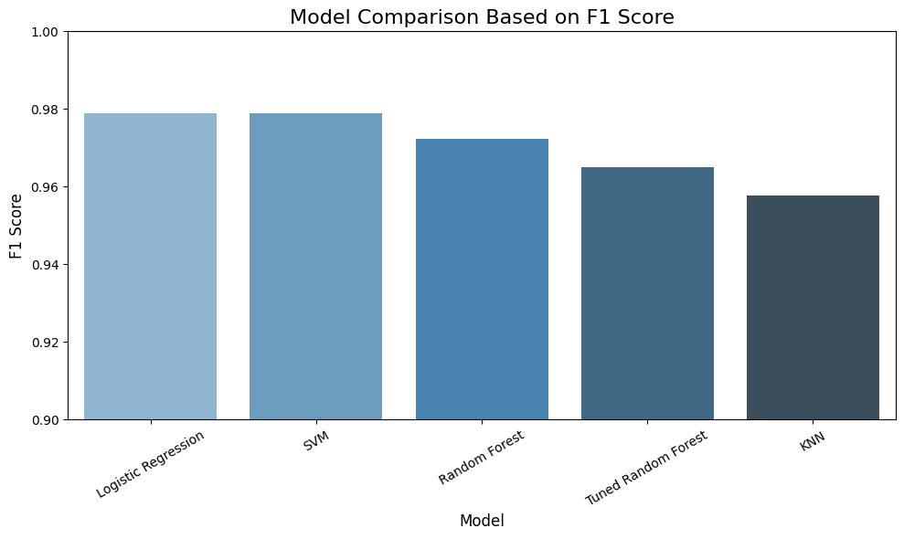

# 🧠 Breast Cancer ML Model Comparison

In this project, I have trained and evaluated multiple machine learning models to predict breast cancer diagnoses based on medical features.

## 📊 Problem Statement
Given a dataset of tumor features, the objective is to classify whether a tumor is **malignant** or **benign** using different machine learning models. Performance is measured using metrics such as Accuracy, Precision, Recall, and F1 Score.

## 🛠️ Workflow

1. **Dataset Used**  
   - 📦 `load_breast_cancer()` from `sklearn.datasets`  
   - No downloads required. Clean and reliable.

2. **Preprocessing**
   - Feature scaling using `StandardScaler`
   - Train-test split (80:20)

3. **Models Trained**
   - Logistic Regression ✅
   - Random Forest
   - SVM
   - KNN
   - Tuned Random Forest (using GridSearchCV)

4. **Evaluation Metrics**
   - Accuracy
   - Precision
   - Recall
   - F1 Score

5. **Hyperparameter Tuning**
   - Tuned Random Forest using GridSearchCV:
     - `n_estimators`: [100, 200]
     - `max_depth`: [None, 10, 20]
     - `min_samples_split`: [2, 5]

6. **Results Visualization**
   - Sorted bar plot comparing F1 Scores of all models

## 📈 Final Results

| Model               | Accuracy | Precision | Recall  | F1 Score |
|--------------------|----------|-----------|---------|----------|
| Logistic Regression| 0.9737   | 0.9722    | 0.9859  | **0.9790** |
| SVM                | 0.9737   | 0.9722    | 0.9859  | **0.9790** |
| Random Forest      | 0.9649   | 0.9589    | 0.9859  | 0.9722    |
| Tuned Random Forest| 0.9561   | 0.9583    | 0.9718  | 0.9650    |
| KNN                | 0.9473   | 0.9577    | 0.9577  | 0.9577    |

 

## 📌 Conclusion
- **Logistic Regression and SVM outperformed all other models** with an F1 Score of 97.90%.
- Hyperparameter tuning boosted Random Forest’s performance, but not enough to surpass the top models.
- This project demonstrates the power of model evaluation and tuning in selecting the most effective classifier.

---

_💻 Built with 💙 by Arpita Pani_
